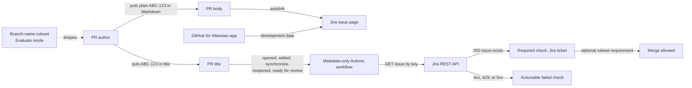

# GitHub-native Jira integration

[](https://github.com/austenstone/jira-github-demo/actions/workflows/jira-ticket.yml)

This repository is a working demo and reference architecture for connecting Jira and GitHub without operating a custom GitHub App or service.

The design uses:

- [GitHub autolink references](https://docs.github.com/en/repositories/managing-your-repositorys-settings-and-features/managing-repository-settings/configuring-autolinks-to-reference-external-resources) for visible, clickable Jira keys in rendered Markdown such as PR bodies and comments.
- The [official GitHub for Atlassian integration](https://github.com/marketplace/github-for-jira) when teams also want branches, commits, pull requests, deployments, and security data to appear in Jira.
- A small, metadata-only GitHub Actions workflow to prove that the Jira issue in a pull request title exists.
- Rulesets for behavior shaping and merge enforcement, without requiring a Jira key in every commit.

The live public example uses Atlassian's public JRASERVER-1 issue. No Jira credentials are stored in this repository.

## Live demo

1. Open [demo pull request #1](../../pull/1) and click the plain JRASERVER-1 reference in its body. GitHub turns that Markdown text into a direct Jira link through the repository autolink.
2. Open the `Jira ticket` check. It extracts the key and calls Jira's issue API to prove that the issue is visible.
3. Edit the title and remove or corrupt the key. The ordinary repository workflow listens for `pull_request_target.edited`, so a new `Jira ticket` run fails.
4. Restore `JRASERVER-1`. The next edited run succeeds.
5. Review [`rulesets/jira-branch-name.evaluate.json`](rulesets/jira-branch-name.evaluate.json) to see how Evaluate mode nudges branches toward `ABC-123-description` without blocking work.

## What appears where

| Surface | What users see | Mechanism |
| --- | --- | --- |
| GitHub PR body, comment, README, issue, or other rendered Markdown | A clickable Jira key such as JRASERVER-1 | GitHub repository autolink |
| GitHub PR title | A plain Jira key used for association and validation; the title itself is not a clickable Markdown surface | Jira integration and this repository's workflow |
| GitHub PR checks | A stable `Jira ticket` pass or failure with actionable error text | This repository's workflow |
| Jira development panel | Linked branches, commits, PRs, deployments, and other development data | Official GitHub for Atlassian integration |
| GitHub branch creation | Evaluate-mode feedback for `ABC-123-description` | Branch-name ruleset |
| GitHub merge box | A required `Jira ticket` check, if enabled | Required status check ruleset |

The official Jira integration solves the Jira-side view. It does not guarantee that a reviewer can quickly find the Jira issue while staying in GitHub. Autolinks solve that discoverability gap when the key appears in rendered Markdown. PR titles remain useful for Jira association and validation, but GitHub does not render title text as a clickable autolink.

## Architecture



No custom webhook receiver, database, GitHub App, or long-running service is required.

## PR title validator

[`jira-ticket.yml`](.github/workflows/jira-ticket.yml) runs on:

- `opened`
- `edited`
- `synchronize`
- `reopened`
- `ready_for_review`
- `merge_group` for merge queue compatibility

The workflow:

- Reads only pull request metadata.
- Checks out only the validator from the trusted default branch, never the PR head.
- Uses explicit `contents: read` permissions.
- Runs on the single-CPU `ubuntu-slim` runner.
- Passes the untrusted PR title through an environment variable instead of interpolating it into shell code.
- Pins `actions/checkout` to a full commit SHA.
- Produces the stable check name `Jira ticket`.

The validator accepts Jira project keys matching the default Jira style: an uppercase letter, 1-9 additional uppercase letters, digits, or underscores, then a positive issue number. Examples: `ABC-123`, `OPS2-7`, and `TEAM_X-42`.

### Result categories

| Result | Meaning |
| --- | --- |
| Missing or malformed key | The title does not contain a valid Jira key |
| `404` | The issue is invalid or hidden from the caller; Jira intentionally may not reveal which |
| `401` | Jira authentication is missing or invalid |
| `403` | The credential is authenticated but lacks permission |
| `429` | Jira rate limited the request |
| `5xx` or network error | Jira is unavailable |
| `200` with an invalid payload | Jira returned an unexpected response |

The implementation fails closed for every non-success result. See the [enterprise rollout guide](docs/enterprise-rollout.md#failure-mode-policy) for alternative operational policy.

## Configure a repository

### Public Jira

Set repository variables and do not create Jira secrets:

```bash
gh variable set JIRA_BASE_URL --body 'https://jira.atlassian.com'
gh variable set JIRA_API_VERSION --body '2'
```

Atlassian's public tracker is a legacy deployment, so this demo uses REST API v2. Jira Cloud repositories should normally use v3.

### Private Jira Cloud

Create repository or organization variables:

```bash
gh variable set JIRA_BASE_URL --body 'https://example.atlassian.net'
gh variable set JIRA_API_VERSION --body '3'
```

Create secrets without placing values on the command line:

```bash
gh secret set JIRA_EMAIL
gh secret set JIRA_API_TOKEN
```

The Jira account needs only permission to browse the projects whose keys are accepted. The workflow uses Jira Cloud basic authentication with the account email and an API token.

### Autolink

Run the idempotent helper:

```bash
JIRA_BASE_URL='https://jira.atlassian.com' \
JIRA_PROJECT_KEY='JRASERVER' \
./scripts/configure-autolink.sh austenstone/jira-github-demo
```

Equivalent API call:

```bash
gh api --method POST repos/OWNER/REPOSITORY/autolinks \
  -f key_prefix='ABC-' \
  -f url_template='https://example.atlassian.net/browse/ABC-<num>' \
  -F is_alphanumeric=false
```

GitHub autolinks are configured per project-key prefix. Repeat the command for each Jira project.

## Rulesets: shape first, enforce second

### Branch names

[`jira-branch-name.evaluate.json`](rulesets/jira-branch-name.evaluate.json) is intentionally in `evaluate` mode. It measures and surfaces the desired `ABC-123-description` convention without blocking existing automation or emergency work.

GitHub's ruleset API currently rejects `branch_name_pattern` for this user-owned demo repository with `422 Invalid rule`. The committed payload is the exact configuration to apply in an organization repository whose plan supports the rule.

Apply it with:

```bash
gh api --method POST repos/OWNER/REPOSITORY/rulesets \
  --input rulesets/jira-branch-name.evaluate.json
```

### Required status check

After the `Jira ticket` check has run at least once, use [`jira-ticket-required.active.json`](rulesets/jira-ticket-required.active.json) as the starting payload for requiring it on `main`. It pins the check to GitHub Actions integration ID `15368` so another status producer cannot satisfy the rule by reusing the name. Review bypass actors before enabling it:

```bash
gh api --method POST repos/OWNER/REPOSITORY/rulesets \
  --input rulesets/jira-ticket-required.active.json
```

Do not require Jira keys in every commit by default. Squash merges, automated commits, dependency updates, and backports make commit-level enforcement noisy. The PR title is the durable review and merge boundary.

### Why not an organization ruleset-required workflow?

Organization ruleset-required workflows are excellent for centrally requiring code or security checks. They are the wrong mechanism for title-edit validation because GitHub ignores the source workflow's `pull_request` activity filters when dispatching a required workflow. Editing only a PR title therefore does not reliably dispatch a fresh required-workflow run.

Use an ordinary repository workflow with the explicit `edited` activity type, then require its stable `Jira ticket` status check. This separates **dispatch correctness** from **merge enforcement**.

## Security model

Private Jira usually requires secrets, including for PRs from forks. The workflow therefore uses `pull_request_target`, which runs from the base repository context. That event is powerful: base-repository secrets may be available to fork PRs.

This implementation keeps that safe by:

1. Never checking out the PR head SHA or PR branch.
2. Checking out the validator only from the repository's default branch.
3. Never executing files, scripts, package managers, or build steps supplied by the PR.
4. Passing the title through `env` and parsing it as data.
5. Granting only `contents: read` to `GITHUB_TOKEN`.
6. Avoiding write APIs entirely.

Do not add `pull_request_target` steps that run PR code. That turns a metadata check into a credential-exfiltration path.

## Enterprise rollout

See [`docs/enterprise-rollout.md`](docs/enterprise-rollout.md) for reusable workflow and caller patterns, organization variables and secrets, fork and Dependabot behavior, merge queue handling, bypass design, failure-mode policy, and rollout sequencing.

## Local development

Requires Node.js 20 or newer and no package installation:

```bash
npm test
npm run check
zizmor .github/workflows
shellcheck scripts/configure-autolink.sh
```

## References

- [GitHub: Configuring autolinks](https://docs.github.com/en/repositories/managing-your-repositorys-settings-and-features/managing-repository-settings/configuring-autolinks-to-reference-external-resources)
- [GitHub: REST API for repository autolinks](https://docs.github.com/en/rest/repos/autolinks)
- [GitHub: Events that trigger workflows](https://docs.github.com/en/actions/reference/workflows-and-actions/events-that-trigger-workflows)
- [GitHub: Secure use reference](https://docs.github.com/en/actions/how-tos/security-for-github-actions/security-guides/security-hardening-for-github-actions)
- [GitHub: Available rules for rulesets](https://docs.github.com/en/repositories/configuring-branches-and-merges-in-your-repository/managing-rulesets/available-rules-for-rulesets)
- [GitHub: Managing a merge queue](https://docs.github.com/en/repositories/configuring-branches-and-merges-in-your-repository/configuring-pull-request-merges/managing-a-merge-queue)
- [GitHub: Reusing workflow configurations](https://docs.github.com/en/actions/reference/workflows-and-actions/reusing-workflow-configurations)
- [GitHub: Dependabot on Actions](https://docs.github.com/en/code-security/reference/supply-chain-security/dependabot-on-actions)
- [Atlassian: Get issue REST API](https://developer.atlassian.com/cloud/jira/platform/rest/v3/api-group-issues/#api-rest-api-3-issue-issueidorkey-get)
- [Atlassian: Link GitHub and Jira Cloud](https://support.atlassian.com/jira-cloud-administration/docs/integrate-with-github/)

## License

[MIT](LICENSE)
